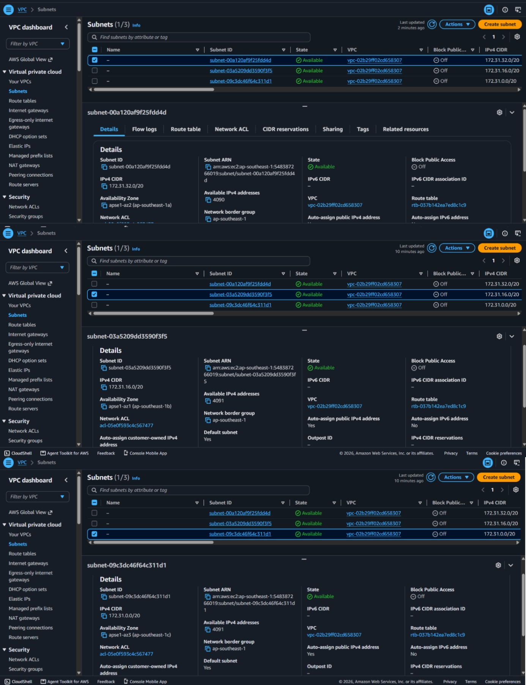
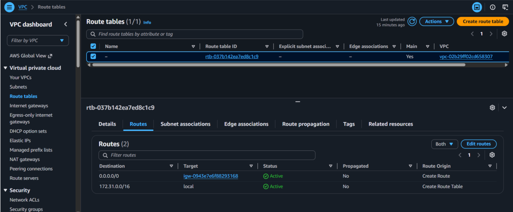
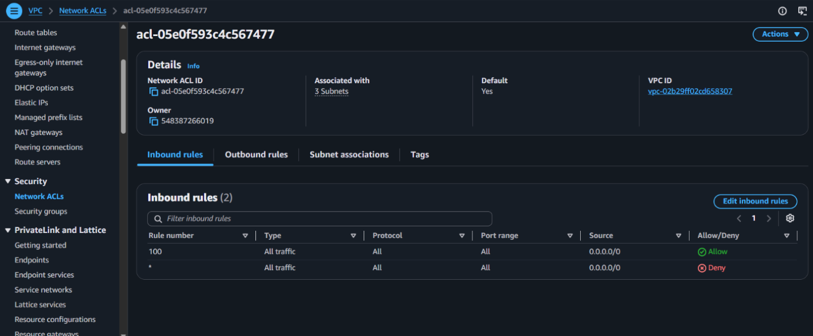
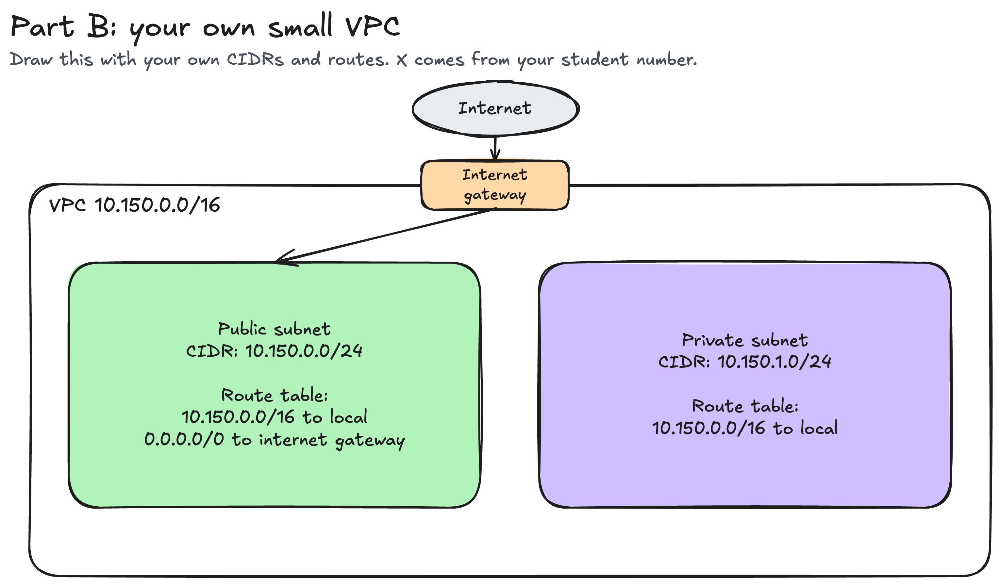

# Assignment 2 Submission

<!--
How to use this template:

1. Copy this file to submissions/assignment-2/<your-github-username>/submission.md
2. Replace every answer placeholder with your own answer. Delete the angle brackets too.
3. Save your four images in the same folder, with the exact file names below.
4. Do not write your full name or your student number in this file.
-->

## About me

- GitHub username: EvapeGT
- Section: IV-ACSAD
- IAM user name that I signed in with: acsad-g04
- X: 150

---

## Part A. Explore

### A1. The VPC

Default VPC IPv4 CIDR:

`172.31.0.0/16`

Number of addresses in that CIDR:

65,536

### A2. The subnets

| Availability Zone | IPv4 CIDR |
| --- | --- |
| `ap-southeast-1a` | `172.31.32.0/20` |
| `ap-southeast-1b` | `172.31.16.0/20` |
| `ap-southeast-1c` | `172.31.0.0/20` |

Screenshot 1. Save it as `screenshot-1-subnets.png` in your folder. The image line below shows it.

### A3. Available addresses

Available IPv4 addresses in each subnet:

`ap-southeast-1a`: 4,090, `ap-southeast-1b`: 4,091, `ap-southeast-1c`: 4,091

Why is the number lower than 4,096?

A `/20` prefix provides 4,096 total addresses ($2^{12}$). AWS reserves 5 IP addresses in every subnet for network management: the network address (first IP), the VPC router (second IP), the AWS DNS service (third IP), a future use reservation (fourth IP), and the network broadcast address (last IP). Therefore, an empty subnet has at most 4,096 − 5 = 4,091 available addresses.

What uses the missing address in the subnet with the lowest number?

`ap-southeast-1a` has 1 fewer address (4,090 instead of 4,091). One Elastic Network Interface (ENI) attached to an active, stopped, or recently created EC2 instance in `ap-southeast-1a` (from the Lab 2 activity) is consuming that 1 missing private IPv4 address.

### A4. The route table

| Destination | Target |
| --- | --- |
| `172.31.0.0/16` | `local` |
| `0.0.0.0/0` | `igw-...` |

Screenshot 2. Save it as `screenshot-2-routes.png` in your folder. The image line below shows it.

### A5. Public or private

Are the default subnets public or private? Which route proves it?

Public. The route table contains the route `0.0.0.0/0` pointing to an internet gateway target (`igw-...`), providing a direct path to and from the public internet.

### A6. The internet gateway

State of the internet gateway:

Attached

What happens to the default subnets if the gateway is detached?

The route `0.0.0.0/0` loses its target and internet connectivity drops. Instances in the default subnets can no longer send traffic to or receive traffic from the internet, though instances within the VPC can still communicate with each other through the `local` route.

### A7. NAT gateways

Number of NAT gateways:

0

Can a server in a new private subnet download updates? Why?

No. A private subnet has no route to an internet gateway, and because there are 0 NAT gateways in the VPC, there is no gateway to translate and forward outbound requests from private IP addresses to the internet.

### A8. The network ACL

| Rule number | Source | Allow or Deny |
| --- | --- | --- |
| 100 | `0.0.0.0/0` | Allow |
| `*` | `0.0.0.0/0` | Deny |

How is a network ACL different from a security group?

A network ACL operates at the subnet boundary and is stateless, meaning return traffic requires an explicit outbound rule, and it evaluates ordered rules supporting both Allow and Deny. A security group operates at the individual instance/ENI level, is stateful (return traffic is automatically allowed regardless of inbound rules), and only supports Allow rules.

Screenshot 3. Save it as `screenshot-3-network-acl.png` in your folder. The image line below shows it.

### A9. The default security group

Inbound rule (type and source):

All traffic, with source set to the `default` security group itself (`sg-...`).

Which resources can send traffic to an instance that uses it?

Only other instances or resources that are explicitly assigned to the same `default` security group. All external inbound traffic from other sources is blocked by default.

---

## Part B. Prepare

### B1. Plan two subnets

- Public subnet CIDR: `10.150.0.0/24`
- Private subnet CIDR: `10.150.1.0/24`

### B2. Route tables

Route table of the public subnet:

| Destination | Target |
| --- | --- |
| `10.150.0.0/16` | `local` |
| `0.0.0.0/0` | `internet gateway` |

Route table of the private subnet:

| Destination | Target |
| --- | --- |
| `10.150.0.0/16` | `local` |

### B3. My VPC diagram

Tool used (Excalidraw, draw.io, Lucidchart, or paper):

Excalidraw

Save your diagram as `vpc-diagram.png` in your folder. The image line below shows it.

### B4. Predict a change

Can you still open the web page from your laptop? Why?

No. Your laptop is on the public internet. Without the `0.0.0.0/0` route targeting the internet gateway, outbound traffic has no path back to the internet and inbound packets cannot be routed to the instance. Having a public IP address alone is not sufficient without an active route pointing to an internet gateway.

Can the instance still reach another instance in the VPC? Why?

Yes. The `local` route for the VPC CIDR (`172.31.0.0/16`) remains active in the route table. The local route automatically connects all subnets within the VPC.

### B5. Place a database

Which subnet gets the database? Why?

The private subnet (`10.150.1.0/24`). A database stores sensitive application data and should never be exposed to the public internet. Placing it in the private subnet ensures it has no direct route to an internet gateway, shielding it from external cyber threats and direct internet attacks while still allowing backend application servers in the public subnet to communicate with it through internal private IP addresses.

### B6. My question about VPCs

What is your question, and what made you think of it?

Can two VPCs with overlapping CIDR blocks (for example, two VPCs using `10.150.0.0/16` or default VPCs using `172.31.0.0/16`) communicate with each other via VPC Peering or Transit Gateway, or does AWS require Private NAT or non-overlapping secondary CIDRs to resolve the routing conflict?
What made me think of it: The README mentions that many companies and default VPCs use the exact same private address range (`172.31.0.0/16`). Since companies often merge networks or connect multi-account environments, handling CIDR collisions seems like a common real-world challenge.
