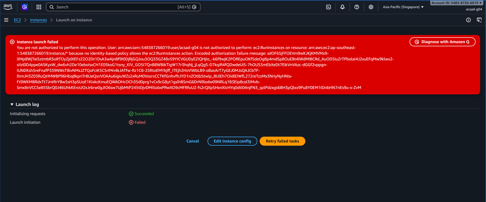
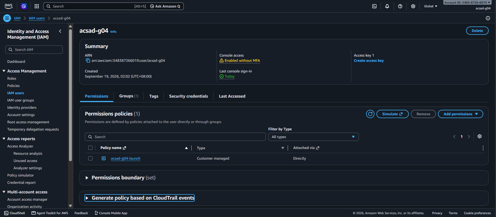
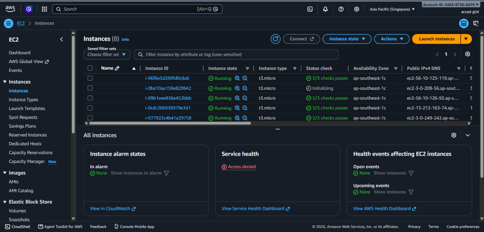
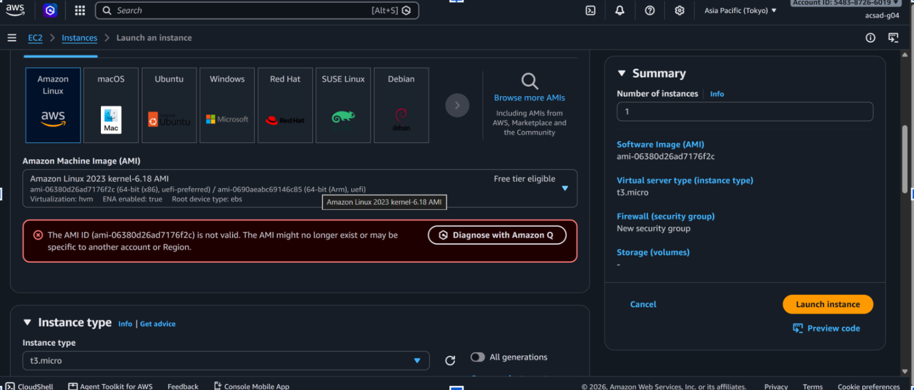
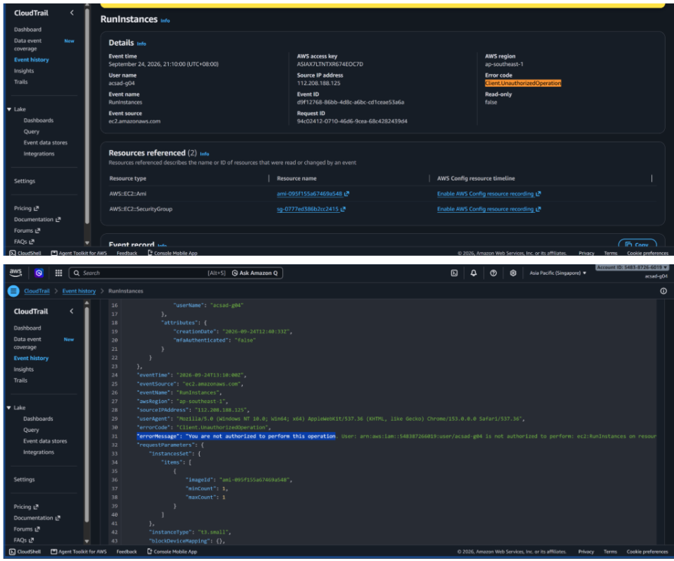

# Lab 1 Submission

## Part B
**Error Action Name:** 
Instance launch failed. You are not authorized to perform this operation. User: arn:aws:iam::548387266019:user/acsad-g04 is not authorized to perform: **ec2:RunInstances** on resource: arn:aws:ec2:ap-southeast-1:548387266019:instance/* because no identity-based policy allows the ec2:RunInstances action. Encoded authorization failure message: sdOF65jFFOEvm9wKJKjKMVMx9-XMP8WjTei5ztmbR3oRTOyZjdXEFzZ2O2Dt1DsA3wAjnBf9l0DjRjGQJou3OQ33GZ48vS9YICVGUDyEZlQhjIo_-k6f9wjK2POREpuOKfSdeOg8p4mdSp8OuE8t4lWdMIBCRd_AuOD5luZrTPbolaI4J2xuEFqMw9klwx2-silzl0D4ppe0ASKyxW_dw6vh2De10eboIsxCH1E05koG1tsny_KlV_GO5l7QnB8WBikTigW17r3hqNj_jLqQgS-D7kqir4fQDwdeUi5-7hOUS3mEbXEdT7EikVnVAzc-dGGf2vppgn-lUmDKsh5reFnafP339NWsT8ivNMxJZTQoFciK5CSrImN4kJATfw-Rz1C8-25RtoEMYkjff_iTejh2HsViWbLB9-obAxArt7YgEJ0MJsQAJCbTF-lhmJH3Z03RuQHMWBP96Hbq8kpnTrBUeQsnVOAAu6igiuWZs2xRuM0VozrxCCTKfGnhvfhJYD1nZOtlbStwip_BUIEh7OldlEIWfL272reTzzMx3NriyNyHNIa-Ft9WKMBRdxTt7JntRryBw5Sh3pSUoE1KlxkcKmuEQWAOHcOcH3Sd0prg1vcX9cG8yt1gslhBSmG6DrN9Iodw09NRLq1B3Eip8col3IMvb-Smx8nVCCSe85SbrQ0J46UHkKEroUOxJr6rw0gJlO6sw7UjbMtP245tDjvDMISobxPRWxO9cMFRfuUZ-fs2rQXPsHxnXIcHYq0dtI04njFN3_qzlPdzxgs6BH3pQlxx9Pu8Y0EM1tDnbHN7nEs9u-x-ZvM

**Screenshot (Part B launch denial with username visible):**

## Part C
**Policy Statement Blanks:**
- `"Action"`: "ec2:RunInstances"
- `"Resource"`: "instance"
- `"ec2:InstanceType"`: "t3.micro"

## Part D
**Security Group Error Text:** 
You are not authorized to perform this operation. User: arn:aws:iam::548387266019:user/acsad-g04 is not authorized to perform: ec2:CreateSecurityGroup on resource: arn:aws:ec2:ap-southeast-1:548387266019:security-group/* because no identity-based policy allows the ec2:CreateSecurityGroup action. Encoded authorization failure message: Aw2xzrt_bx-ff_kVry8B-4AZhE0On_yH8EIh-dPc4WxE06yEP-xCqjW0PWQNM4HnoqBHCQXEFbZaLVLwOn_MwAJcLQTHcvwNYHE2xUmN2CeMej730A10cLiMhtlqAfE_1-khZxStRnfXB2-3XsuJ2GEBxNE0e66gIDLYjIbWzEMLYzi56193eLK42VAv9d9Nieanq-svGBsVIUpqlqcm215ra0q6qdZAWYp6HnCZyjN3k7Irm9UKQHTYYIu4vkFMVg0_qezg4Wt7hR2Rdd341yNbJrn9EMLyqtcGcBtMzJ_n-_ddrwKa8j4STJeR2tU1OBjQmiEdFC59xzr1B9YmxLukF0_LrghKyBQKZAwMng763Tr67y2YgVUDx5RxT7BD8mj9zNNdboA_7ternlo0UaWNVnuEQS-FKCqkNfQ3A4zI4NF9Gw_L0BiHRA06q4cGYz8E-rqu8OSg7WyR8MnS8s7Pgzh0NbR_IsnXSj9KXPuTFR_8339alSxQg9M1LB-ZYNy3EHaPLVxDazme89WDzMhLltbi-FV9y4V1sc

**Running Instance Time:** 2026/09/24 21:43 GMT +8

**Screenshot 1 (Permissions tab listing <user>-launch):**

**Screenshot 2 (Instance in Running state):**

## Part E
**t3.small / Tokyo Denial Error:** 
Instance launch failed. You are not authorized to perform this operation. User: arn:aws:iam::548387266019:user/acsad-g04 is not authorized to perform: ec2:RunInstances on resource: arn:aws:ec2:ap-southeast-1:548387266019:instance/* with an explicit deny in a permissions boundary.

Tokyo region selector error:
VPC: You are not authorized to perform this operation. (UnauthorizedOperation)
AMI: You are not authorized to perform this operation. (UnauthorizedOperation)

**Screenshot 1 (t3.small or Tokyo denial):**

**Screenshot 2 (CloudTrail event showing errorMessage):**

## Part F Questions
1. Which action did the Part B error name?
   It named the action `ec2:RunInstances`.

2. In your policy, which condition limits `ec2:RunInstances`?
   The condition `"StringEquals": { "ec2:InstanceType": "t3.micro" }`, which restricts instance creation strictly to the `t3.micro` size.

3. After you attached `ec2:*` on `*`, why was `t3.small` still denied? Name the boundary statement.
   It was denied because of the statement `DenyAnyInstanceTypeButT3Micro` inside the `umak-lab-boundary` permissions boundary. In AWS IAM policy evaluation logic, an explicit `Deny` in a permissions boundary always overrides any `Allow` defined in an identity-based policy.

4. Why is `ec2:*` on `*` a poor policy even with a boundary?
   `ec2:*` on `*` severely violates the principle of least privilege by granting blanket administrative access to every EC2 action that the boundary does not explicitly restrict. Even with the boundary blocking non-Singapore regions and non-t3.micro instances, an identity with `ec2:*` could still delete VPC route tables, disassociate elastic IPs, create unmanaged key pairs, or tamper with networking resources.

5. In two sentences: what does the boundary control that your policy cannot?
   A permissions boundary establishes the absolute maximum ceiling of permissions an IAM user or role can ever exercise, acting as an immutable guardrail set by the account administrator. An identity-based policy can only grant privileges up to that boundary line and has no power to expand permissions beyond it or override boundary-level denies.