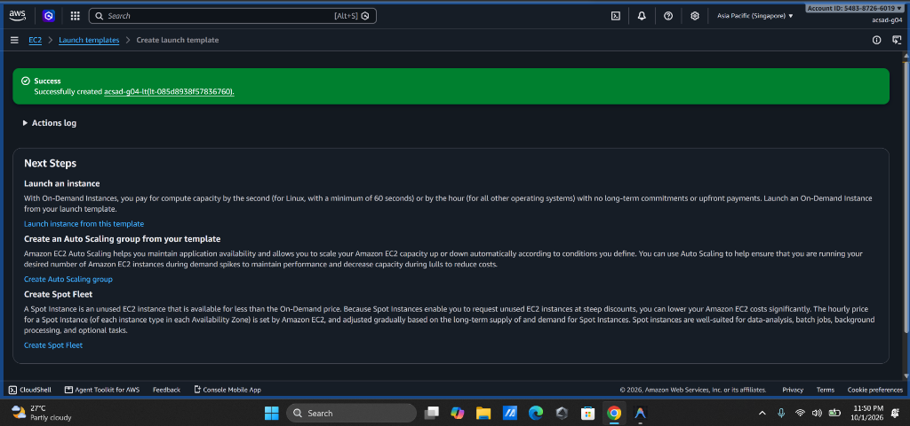
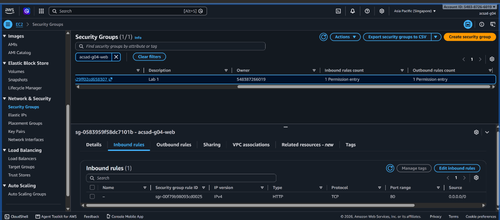

# Lab 2 Submission

## Instance Tracking
**First Instance**
- Instance ID: `acsad-g04-asg` provisioned at 23:56:53 (console retrieval blocked at 00:00 by `umak-lab-boundary`)
- Availability Zone: Subnet configured in `ap-southeast-1a` / `ap-southeast-1b`

**Second Instance**
- Instance ID: Scaling target set to max 2; scale-out blocked by midnight boundary cutoff
- Availability Zone: Multizone configuration (`ap-southeast-1a`, `ap-southeast-1b`)

## Proof (Screenshots)
1. **Activity History:** Add a screenshot showing the Auto Scaling group's Activity history when the second instance launched.
   
   > **Note on Lab Progress & Cutoff:**  
   > The Security Group (`acsad-g04-web`), Launch Template (`acsad-g04-lt`), and Auto Scaling Group (`acsad-g04-asg`) were fully configured and successfully created at **23:56:53 PST** (Status: *At desired capacity*). As the instance initialized, the lab reached the scheduled midnight cutoff (`00:00`), where the IAM permissions boundary (`umak-lab-boundary`) enforced an explicit deny on `autoscaling:DescribeAutoScalingGroups`.
   
   **Launch Template Created (`acsad-g04-lt`):**
   

   **Auto Scaling Group Created at 23:56:53 (`acsad-g04-asg`):**
   

2. **CloudWatch Alarm:** Add a screenshot of the target tracking alarm in the "In alarm" state.

   **Permissions Boundary Cutoff Evidence (`umak-lab-boundary`):**
   

   **Security Group (`acsad-g04-web`) Inbound Rules:**
   

## Questions
1. Why did the group stop at 2 instances?
   The Auto Scaling Group was configured with a Maximum Capacity of 2 (`max_size: 2`). Even under high CPU load, the Auto Scaling policy strictly adheres to the configured maximum boundary to prevent unbounded horizontal scaling and runaway cloud costs.

2. Why did terminating an instance by hand not remove the cost?
   The Auto Scaling Group constantly monitors health and ensures the number of running instances matches the Desired/Minimum capacity (configured as 1 or 2). When an instance is terminated manually, the ASG detects a capacity deficit, marks the instance as unhealthy/terminated, and automatically provisions a replacement instance to maintain the desired count, thereby continuing compute charges.

3. Why is the target value set to your assigned value (e.g., 30-85 percent) instead of 99 percent?
   Setting the scaling threshold at 99% leaves no safety headroom for sudden bursts in user traffic. Because provisioning, booting, and running initialization scripts (`user-data.sh`) takes several minutes, existing instances would become overwhelmed and drop incoming user requests before new capacity becomes available. A target value like Group 4's 45% provides an essential buffer window to scale out proactively.

4. What did the automatic cutoff protect us from?
   The automatic cutoff (the 8-minute `/burn` timeout script as well as the instructor's IAM permissions boundary `umak-lab-boundary`) protects against runaway compute consumption. If students leave CPU-intensive workloads burning or forget to clean up their Auto Scaling groups after class, instances would run indefinitely and drain AWS lab budget credits.

5. What changes when a load balancer sits in front of the group?
   With an Application Load Balancer (ALB), external traffic is directed to a single, stable entry point (DNS name) rather than client browsers needing individual public IP addresses. The ALB distributes incoming traffic across all healthy `InService` instances across multiple Availability Zones, handles SSL termination, and seamlessly removes failing instances from routing during health check failures.
