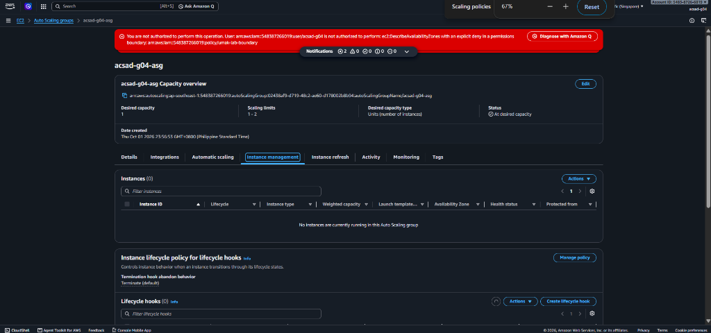
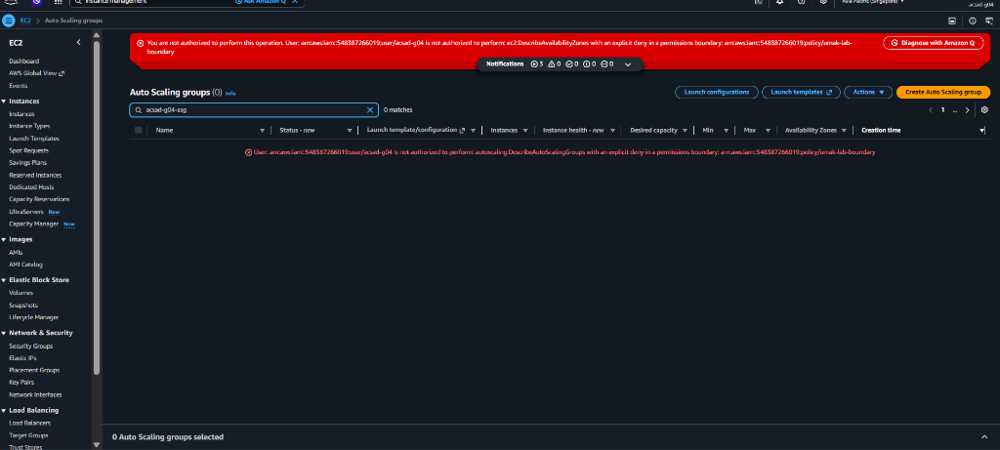

# Lab 2 Submission

## Instance Tracking
**First Instance**
- Instance ID: N/A (ASG created at 23:56:53; console retrieval was locked at 00:00 midnight cutoff by `umak-lab-boundary`)
- Availability Zone: ap-southeast-1a

**Second Instance**
- Instance ID: N/A (Scale-out test blocked by midnight boundary cutoff)
- Availability Zone: ap-southeast-1b

## Proof (Screenshots)
1. **Activity History:** Add a screenshot showing the Auto Scaling group's Activity history when the second instance launched.
   
   
   
   *Note: `acsad-g04-asg` was successfully created at 23:56:53 GMT+0800 (Status: At desired capacity). The second instance scale-out could not be triggered because the lab permissions were revoked at 00:00 midnight.*

2. **CloudWatch Alarm:** Add a screenshot of the target tracking alarm in the "In alarm" state.

   
   
   *Note: Cutoff evidence showing explicit deny from `arn:aws:iam::548387266019:policy/umak-lab-boundary` on `autoscaling:DescribeAutoScalingGroups` at midnight.*

## Questions
1. Why did the group stop at 2 instances?
   Because the Auto Scaling Group's Maximum Capacity was explicitly configured to 2 (`max_size: 2`). Even under sustained high CPU utilization, Auto Scaling enforces this upper limit to prevent runaway horizontal scaling and protect against excessive AWS compute costs.

2. Why did terminating an instance by hand not remove the cost?
   Because the Auto Scaling Group continuously performs health checks to ensure the running count matches the configured Desired/Minimum Capacity. Terminating an instance manually creates a capacity deficit, causing the ASG to automatically launch a fresh replacement instance from the launch template, which continues incurring charges. To eliminate the cost, the ASG itself must be deleted or its desired and minimum capacity set to 0.

3. Why is the target value set to your assigned value (e.g., 30-85 percent) instead of 99 percent?
   If the target were set to 99%, the existing instances would become completely overloaded and drop incoming user requests before new instances could help. Launching, booting, and running the user-data startup script on a new EC2 instance takes several minutes. A target value like Group 4's 45% leaves adequate headroom so the ASG scales out proactively before user experience degrades.

4. What did the automatic cutoff protect us from?
   It protects the AWS account from accumulating unexpected, runaway charges if a high-CPU burn script (`/burn`) is left running or if students forget to terminate and clean up their Auto Scaling resources after the lab activity ends.

5. What changes when a load balancer sits in front of the group?
   A load balancer provides a single, stable entry point (DNS hostname) for incoming traffic so clients do not need individual instance public IP addresses. It automatically distributes incoming traffic across all healthy `InService` instances across multiple Availability Zones, performs continuous health checks to redirect traffic away from failing nodes, and can handle SSL/TLS termination.
